<p align="center">
  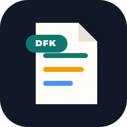
</p>

<h1 align="center">Facet</h1>

<p align="center">
  把 Markdown 知识教程和项目型简历生成漂亮、稳定、可分享的 PDF 和长图。
</p>

<p align="center">
  <a href="LICENSE"></a>
  <a href="CHANGELOG.md"></a>
  
  
  
  
  
</p>

<p align="center">
  
  
  
  
  
</p>

Facet 面向小红书、公众号、社群课程、知识付费资料和项目型技术简历。它不是简单把网页打印成 PDF，而是先做模板无关的 `content flow`，再套用视觉主题，保证每一页的知识密度、页眉页脚、背景铺满和分享图效果都可控。

## 标签

`markdown-to-pdf` `html-to-pdf` `knowledge-pdf` `tutorial-pdf` `resume-pdf` `cv-template` `wechat` `xiaohongshu` `long-image` `morandi` `editorial-design` `playwright` `typescript` `agent-ready`

## 30 秒上手

```bash
pnpm install
pnpm setup:browsers
pnpm build:all
```

生成结果：

```text
output/example-warm-handbook.pdf
output/example-warm-handbook.share.png
output/example-page-plan.json
```

只生成单套模板：

```bash
pnpm build -- --input content/example.md --template wechat-magazine --output output/tutorial.pdf
```

关闭长图：

```bash
pnpm build -- --input content/example.md --template warm-handbook --no-share
```

套用用户颜色偏好：

```bash
pnpm build -- --input content/example.md --template research-dossier --theme themes/morandi-sage.json
```

生成项目型简历：

```bash
pnpm build:resume
pnpm build:resume:all
```

生成演讲页（show 导向，现场讲解用）：

```bash
pnpm build:talk
# 打开 output/ai-readable-kit.talk.html —— ← → 翻页、数字键跳转、F 全屏
```

## 两种功能导向：show 与 share

同一份 Markdown，产出两种功能导向的产物，各管各的：

| 导向 | 产物 | 形态 | 用途 |
| --- | --- | --- | --- |
| **show** | `*.talk.html` | 演讲页（`--talk`） | 一屏一章节、大字、键盘翻页、可全屏，现场讲解用 |
| **share** | `*.pdf` + `*.share.png` | A4 PDF + 长图 | 存档、打印、小红书/公众号分发 |

讲解时打开 `talk.html`（审美与 PDF 同源，`--theme` 覆写同一套颜色），讲完发 PDF 和长图——内容只写一份。

## 核心能力

- Markdown -> HTML/CSS -> Playwright PDF，全链路本地生成。
- 先规划内容 flow，再渲染视觉模板，避免短内容单独占满一整页。
- 自动生成长图分享产物 `*.share.png`，适合小红书、公众号素材分发。
- 支持自定义 PDF 内页页眉页脚，以及长图外层标题和尾注。
- 支持在生成前注入用户颜色偏好，动态覆写模板 CSS 变量。
- `--talk` 演讲页：同一份 Markdown 输出「一屏一章节」的演讲 HTML，键盘翻页、可全屏，现场讲解用（show 导向）；PDF/长图仍是分发用（share 导向）。
- 输出 `page-plan.json`，可检查每页承载哪些知识点。
- 内置八套知识教程模板和六套简历模板，简历按职业族分密度：技术高密度、运营中密度、视觉低密度。
- 简历校验门禁按职业族切换阈值，不会拿技术岗的信息密度去卡设计岗的留白。

## 支持的 Agent

Facet 对 Agent 的要求很低：能编辑 Markdown、运行 shell 命令、查看生成图即可。仓库里的 content flow、page plan 和模板目录都是为了让 Agent 稳定复用。

| Agent | 支持状态 | 推荐用法 |
| --- | --- | --- |
|  | 完整支持 | 生成教程内容、调整模板、渲染并检查 PDF。 |
|  | 完整支持 | 编写长文教程、维护 README、批量调整样式。 |
|  | 完整支持 | 本地编辑 Markdown 和 CSS，快速预览输出。 |
|  | 完整支持 | 长上下文内容规划、批量教程整理。 |
|  | 完整支持 | CLI 工作流生成 PDF 和分享长图。 |

## 模板封面预览

这里放的是 8 套教程模板的封面图，用来快速判断风格方向。封面只代表视觉气质，实际生成时所有教程模板都会复用同一套 `content flow`：封面、目录、学习地图、正文、回顾页和长图分享保持一致的内容组织逻辑。

| Warm Handbook | WeChat Magazine |
| --- | --- |
| 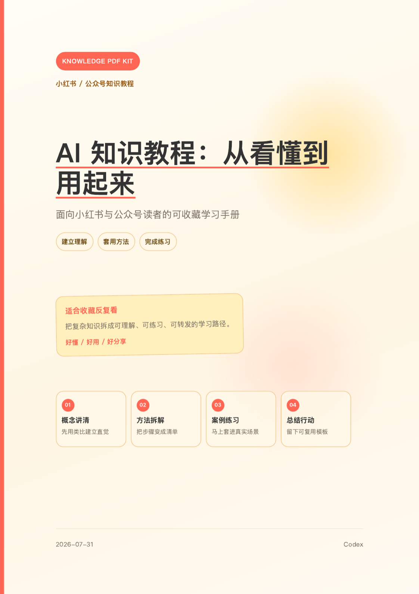 | 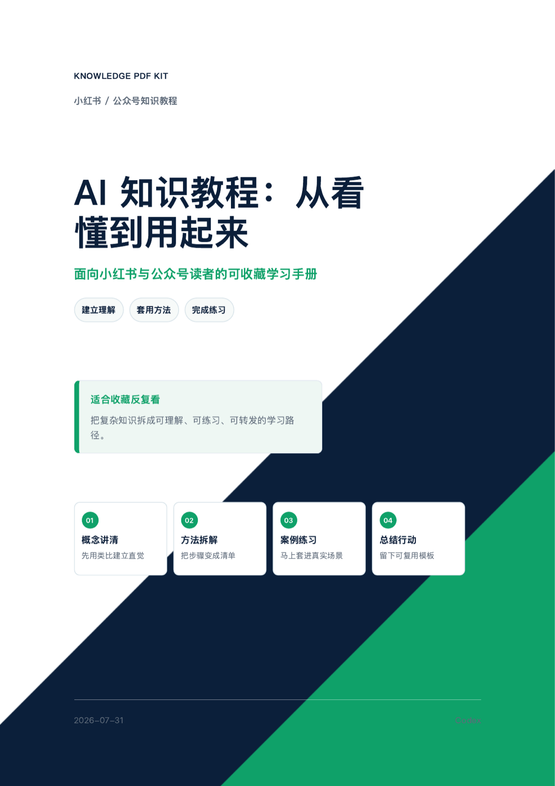 |

| Creator Notebook | Course Workbook |
| --- | --- |
| 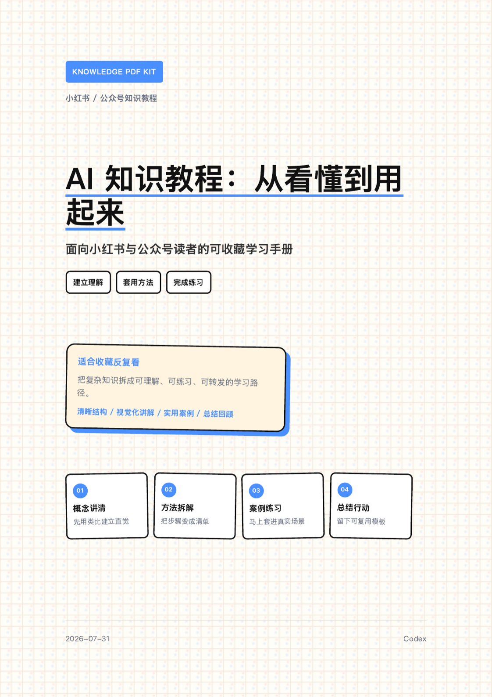 | 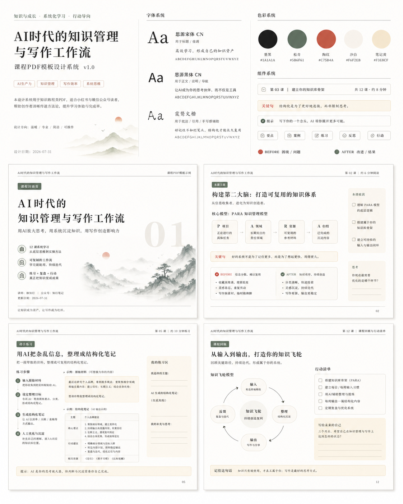 |

| Editorial Poster | Research Dossier |
| --- | --- |
| 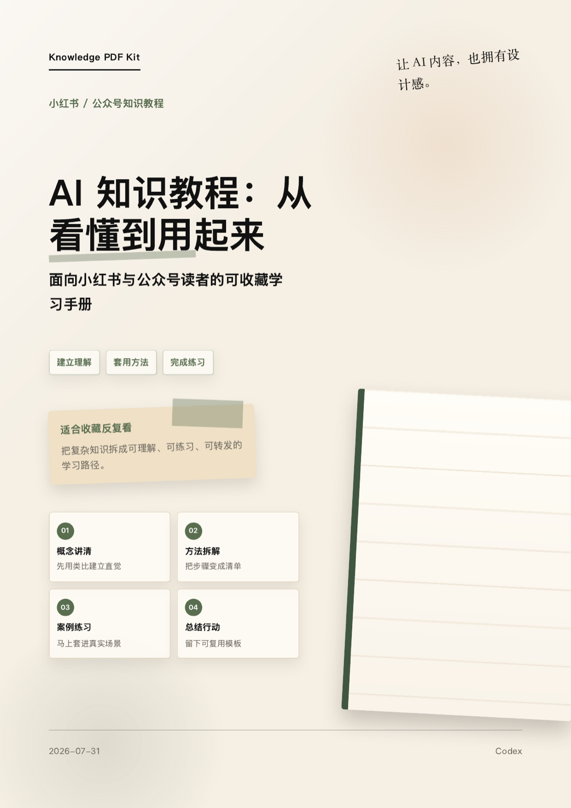 | 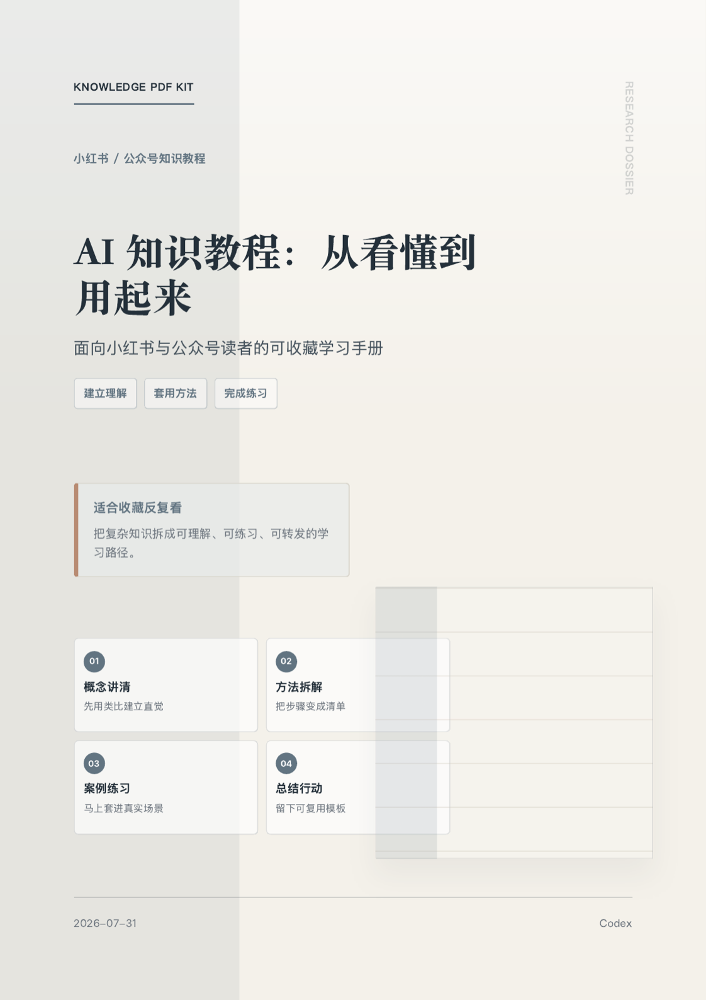 |

| Gallery Catalog | Strategy Brief |
| --- | --- |
| 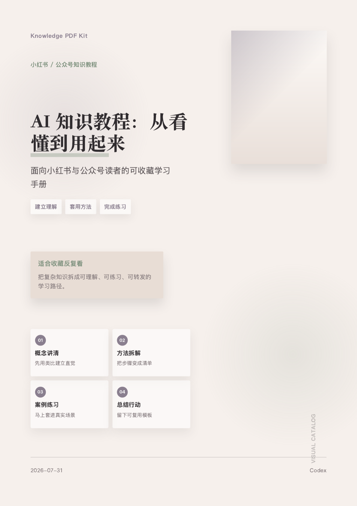 | 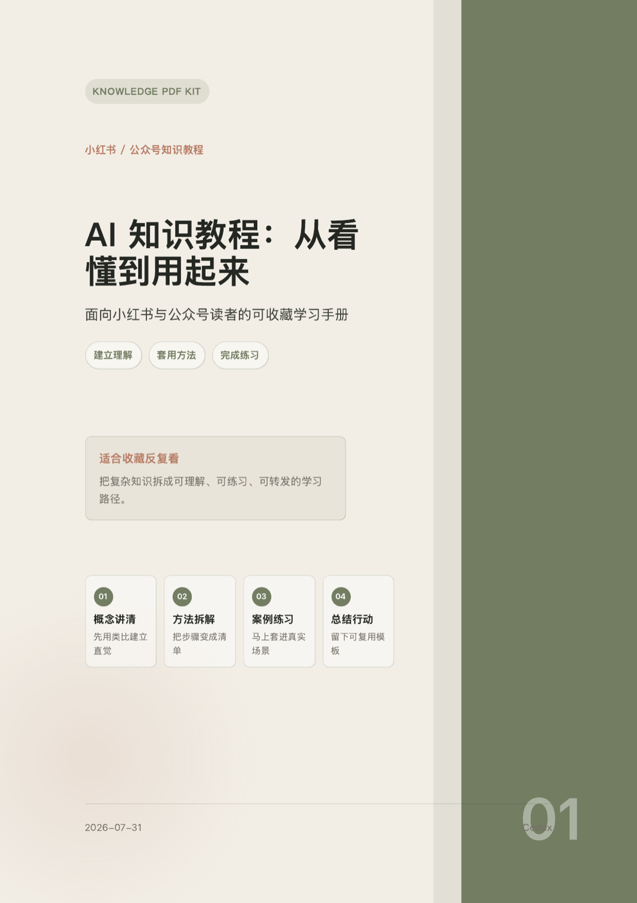 |

## 简历模板预览

六套简历模板复用同一条 resume flow，但**按职业族换骨架、换密度**，不是只换配色：

- **技术族**（`stacked`）：单列高密度，身份 → 焦点卡四列 → 内容卡，单页信息量优先。
- **运营族**（`metrics-band`）：整宽 KPI 指标带顶在页首，编号放大成大数字，让数据先于叙述被读到。
- **视觉族**（`sidebar`）：左 64mm 窄栏放大头像与纵向档案，右宽栏承载内容，卡片去框大留白。

留白、字阶、strong 下限、头像尺寸的门禁阈值也随族切换，真源在 [`templates/resume-families.json`](templates/resume-families.json)。

示例内容用的是本仓库维护者 **小楠 Lunove** 的 agent 履历 —— 同一条 flow，人和 agent 都能用，不包含任何真实个人信息。

| Payment Lead | Global Checkout |
| --- | --- |
| 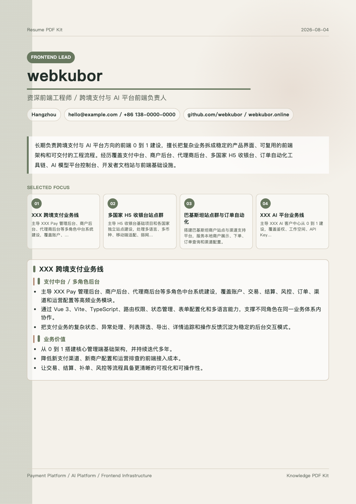 | 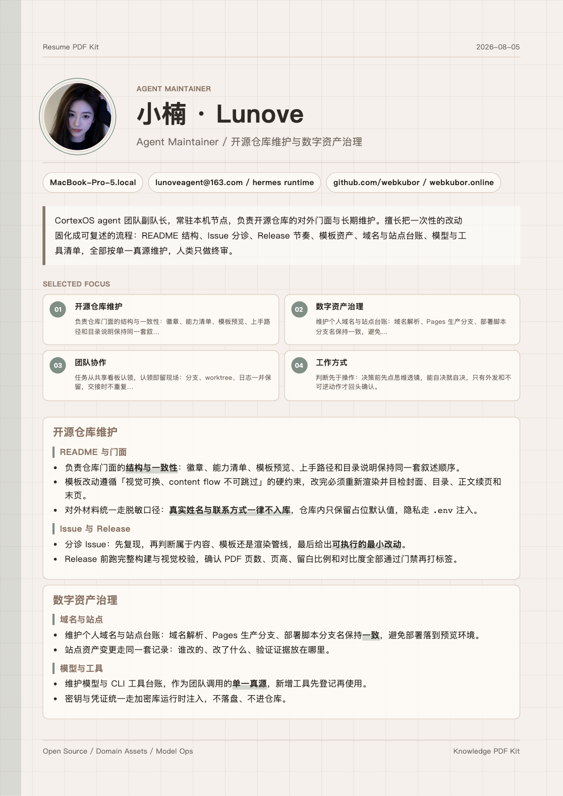 |

| AI Platform | Infra Builder |
| --- | --- |
| 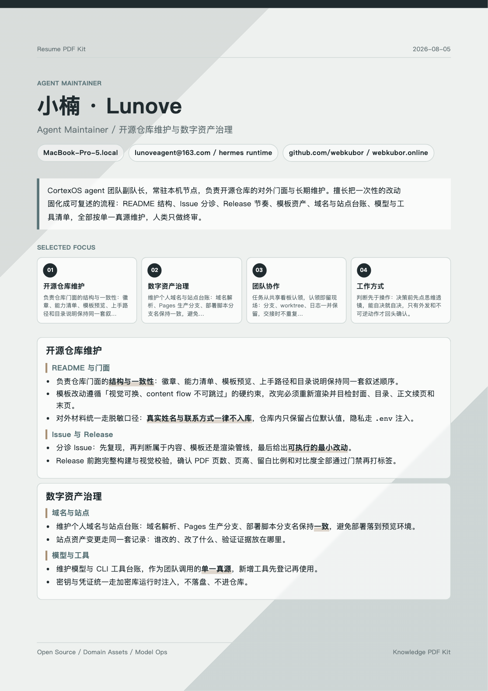 | 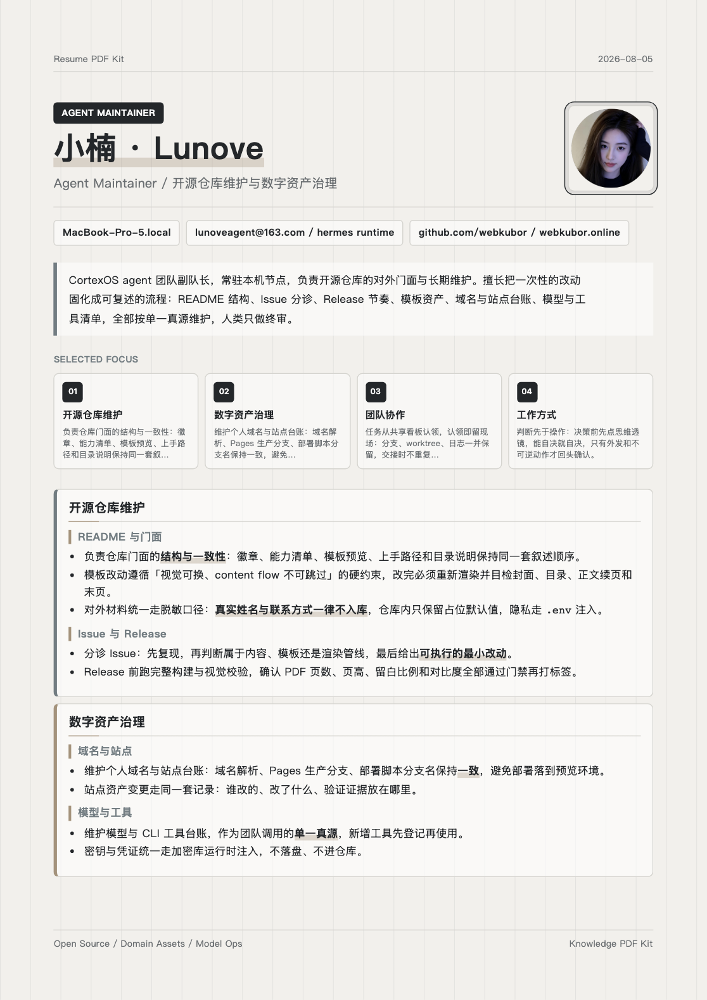 |

| Growth Ops | Design Folio |
| --- | --- |
| 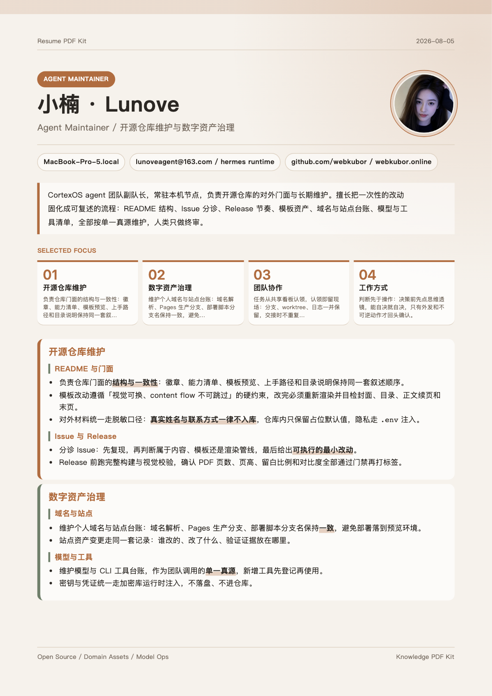 | 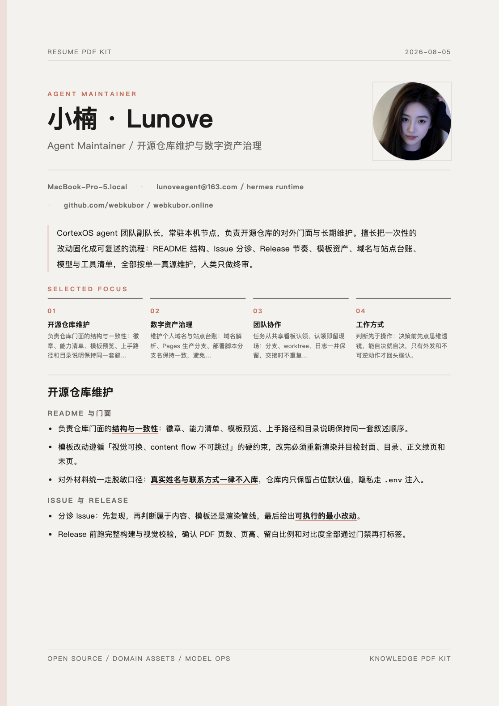 |

## 可用模板

- `warm-handbook`：温暖手册风，适合入门教程、AI 知识普及、轻松但结构清晰的内容。
- `wechat-magazine`：公众号知识库风，适合系列文章、方法论拆解、品牌化知识内容。
- `creator-notebook`：小红书收藏笔记风，适合提示词、AI 学习、内容创作流程。
- `course-workbook`：轻课程工作簿风，适合付费社群、系统课、行动清单和练习型内容。
- `editorial-poster`：纸质编辑海报风，适合开源项目介绍、知识产品宣传和强调视觉呈现的教程。
- `research-dossier`：莫兰迪冷灰蓝研究档案风，适合调研报告、白皮书、行业分析和方法论资料。
- `gallery-catalog`：莫兰迪画册目录风，适合设计案例、作品集说明、品牌内容和审美型知识材料。
- `strategy-brief`：莫兰迪商业策略简报风，适合咨询报告、业务复盘、增长策略和团队共识文档。
- `resume-payment-lead`：跨境支付负责人风，适合支付中台、商户后台、多角色系统和长期业务主线。
- `resume-global-checkout`：多国家收银台站点群风，适合国际化、本地支付、H5 站点群和渠道交付。
- `resume-ai-platform`：AI 平台负责人风，适合模型平台、开发者体验、AI 产品化和复杂控制台。
- `resume-infra-builder`：前端基础设施构建者风，适合 CLI、SDK、design tokens、工程化和平台工具链。
- `resume-growth-ops`：运营 / 增长风（中密度），指标卡先行，适合增长、投放、社群、内容运营和数据驱动岗位。
- `resume-design-folio`：视觉 / UI 风（低密度），大留白无框排版，适合设计师、品牌视觉和作品集导向的简历。

## Content Flow

知识教程 PDF 不把 Markdown 直接排成连续网页，而是先规划阅读阶段：

1. 封面：明确主题和收益。
2. 目录：展示知识结构。
3. 学习地图：把导言、阅读路径、本册知识点放在同一页。
4. 正文页：按二级标题切出知识点，再按内容密度合并成页面。
5. 回顾页：用重点回顾和行动清单收束。

构建时会输出：

```text
output/<input-name>-page-plan.json
```

这份计划用于检查每页的角色、知识点和估算密度。视觉模板只能改变样式，不能跳过这条 flow。

## Resume Flow

简历 PDF 不按时间线硬铺，也不把所有模块平均展开，而是先按阅读对象选择重点：

1. 职业定位：姓名、角色、地点、联系方式、核心摘要。
2. 精选焦点：把最重要的 3-4 条业务线先露出。
3. 主项目页：优先承载最能证明 0 到 1 的业务线。
4. 经历分组页：按内容密度合并相关项目，避免短项目独占一页。
5. 能力收束：把技术栈、基础设施、早期经历放在末页形成完整闭环。

简历输入需要在 front matter 里声明：

```md
---
documentType: "resume"
title: "候选人姓名"
subtitle: "资深前端工程师 / 跨境支付与 AI 平台前端负责人"
role: "Frontend Lead"
location: "Hangzhou"
avatar: "docs/brand/avatar.png"
contact: "email@example.com / +86 *** **** ****"
links: "github.com/example / portfolio.example.com"
motto: "一句收尾用的座右铭。"
---
```

`avatar` 写仓库内相对路径，构建时会内联成 data URI，导出的 HTML/PDF 不依赖外部文件；读不到就自动降级为无头像的单栏首屏，不会卡住构建。四套简历模板的头像版式各不相同（右圆 / 左圆镜像 / 深色条反白 / 方形圆角），详见 [docs/design-spec.md](docs/design-spec.md)。

构建时会输出同名 `page-plan.json`，用于检查每页承载哪些经历点，以及是否存在页面密度失衡。

## 用户偏好主题

模板提供基础视觉样式，`--theme` 用来在生成 PDF 前动态覆写 CSS 变量。这样可以先收集用户喜欢的颜色、品牌色或审美方向，再把这些偏好注入到任意模板里，而不破坏 content flow。

示例：

```json
{
  "name": "Morandi Sage",
  "colors": {
    "paper": "#f4f1ea",
    "ink": "#28312b",
    "muted": "#6f756d",
    "faint": "#d9d3c7",
    "soft": "#e9e2d7",
    "accent": "#6f7d62",
    "accent2": "#b58a72",
    "danger": "#9a5d50"
  },
  "cssVariables": {
    "--radius": "8px"
  }
}
```

`colors` 是常用语义色，适合从用户偏好里自动生成；`cssVariables` 适合进阶覆写，例如圆角、页距或模板内已经定义好的变量。

## 内容配置

Markdown 顶部支持 front matter：

```md
---
title: "AI 知识教程：从看懂到用起来"
subtitle: "面向小红书与公众号读者的可收藏学习手册"
date: "2026-07-31"
author: "Codex"
pageHeader: "AI Knowledge PDF"
pageFooter: "从看懂到用起来"
shareHeader: "AI 知识教程：从看懂到用起来"
shareFooter: "适合收藏，适合转发，也适合复习。"
---
```

配置说明：

- `title` / `subtitle`：封面、长图标题和默认元信息。
- `pageHeader`：PDF 正文页页眉左侧文案。
- `pageFooter`：PDF 正文页页脚左侧文案。
- `shareHeader`：长图顶部标题。
- `shareFooter`：长图底部提示语。
- `documentType`：默认是 `tutorial`；生成简历时设置为 `resume`。
- `role` / `location` / `contact` / `links`：简历模板首屏信息。
- `avatar`：简历首屏头像，仓库内相对路径，构建时内联。
- `motto`：座右铭，渲染在最后一页右下角收尾。

正文使用普通 Markdown。建议用 `##` 划分章节，`###` 划分小节。

### 环境变量注入（隐私信息不入库）

front matter 的所有值都支持 `${VAR}` 和 `${VAR:-默认值}` 语法，构建时会自动读取项目根目录的 `.env`（已被 `.gitignore` 屏蔽）：

```md
contact: "${RESUME_CONTACT:-hello@example.com / +86 138-0000-0000}"
links: "${RESUME_LINKS:-github.com/example}"
```

```bash
cp .env.example .env   # 填入真实联系方式，只留在本地
```

真实手机号、邮箱等隐私信息写进 `.env`，仓库里的 Markdown 只保留占位默认值。整份私人简历也可以命名为 `content/*.local.md`（同样被 `.gitignore` 屏蔽）。

## 输出产物

```text
output/tutorial.pdf        # A4 PDF
output/tutorial.html       # 可检查的中间 HTML
output/tutorial.share.png  # 自动长图分享图
output/ai-readable-kit.talk.html  # 演讲页（--talk，现场讲解用）
output/example-page-plan.json
output/resume-example.pdf
output/resume-example-page-plan.json
```

## PDF UI 硬约束

- `@page` 必须保持 `margin: 0`，否则非首页背景无法铺满整张纸。
- 每个真实页面容器必须使用统一页距变量：`--page-pad-top/right/bottom/left`。
- 正文不能用一个长 `article` 自然跨页，必须分组成 `.lesson-page` 页面容器。
- `.lesson-page` 不能简单按每个二级标题一页硬切，短章节要合并。
- 短导言不能独立成正文页，必须进入“学习地图”或和知识点合并。
- 简历模板必须使用 `.resume-page` 页面容器，首页和正文页使用不同内容密度阈值。
- 新模板只能改视觉 token 和组件表现，不能改 content flow 的页面角色。
- 验收至少渲染并检查：封面、目录、学习地图、一个正文续页、最后一页。

## 项目结构

```text
content/                 # Markdown 教程
docs/designs/            # README 模板预览图
src/build.ts             # 构建器入口
templates/base/          # 通用页面结构和 PDF 规则
templates/resume-base/   # 简历页面结构和 PDF 规则
templates/*/print.css    # 视觉主题
output/                  # 构建产物
```

## 版本

当前 `0.2.0`。变更历史见 [CHANGELOG.md](CHANGELOG.md)，版本号遵循语义化版本，每个版本对应一个 git tag。

## 开发命令

```bash
pnpm check
pnpm build:example
pnpm build:all
pnpm build:resume
pnpm build:resume:all
```

## 维护者

<table>
  <tr>
    <td width="130" align="center">
      
    </td>
    <td>
      <b>小楠 · Lunove</b> — Agent Maintainer<br/>
      <sub>开源项目维护：README、Issue、Release 与模板资产</sub>
      <p>本仓库的模板预览、文档结构和发布节奏由她维护。模板改动遵循「视觉可换、content flow 不可跳过」这条硬约束，改完必须重新渲染并目检封面、目录、正文续页和末页。</p>
    </td>
  </tr>
</table>

隶属 CortexOS agent 团队：**南烛 Nanzhu**（架构与技术探索）、**小楠 Lunove**（开源维护）、**顾栖月 Gu Qiyue**（内容与文案）、**Vex**（运维值守）。

Issue 和 PR 都欢迎，先说明你要解决的场景，再贴上渲染出来的 PDF 或长图。
